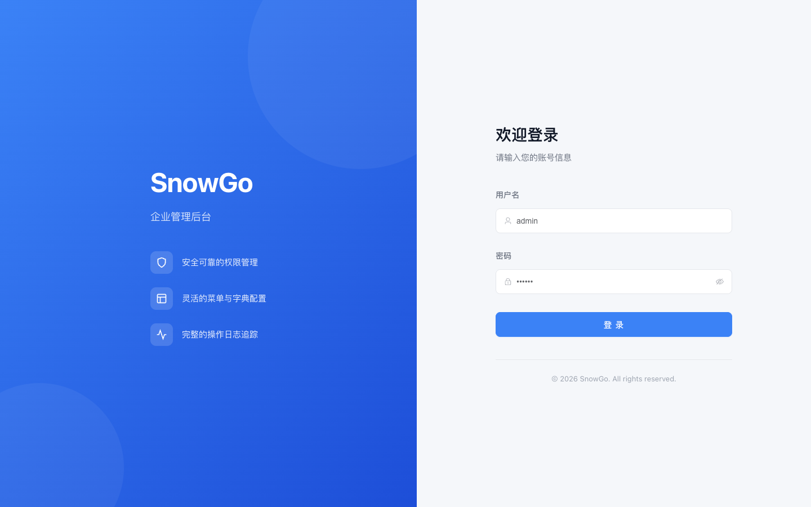
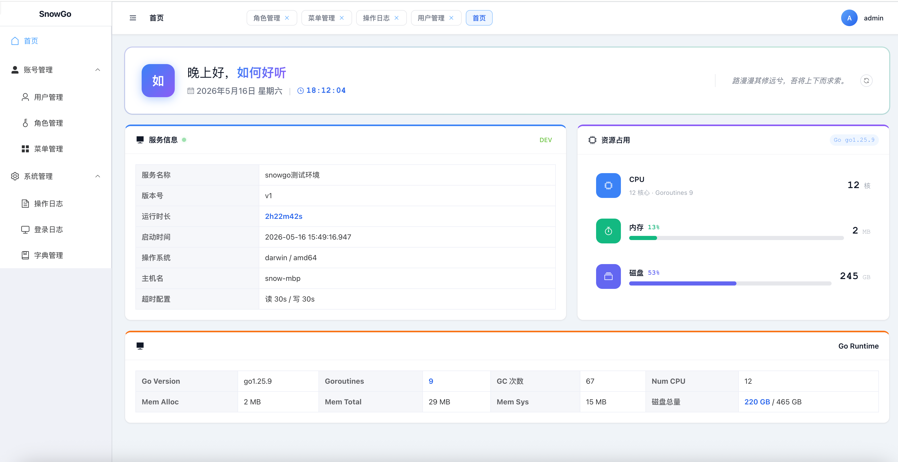

# snowgo-vue

<p align="center">
  
  
  
  
  
</p>

<p align="center">
  基于 Vue 3 + TypeScript + Element Plus 构建的企业管理后台前端，
  与 <a href="https://github.com/sy159/snowgo">snowgo</a>（Go/Gin）后端配套使用。
</p>

## 系统截图

### 登录页

<p align="center">
  
</p>

### 管理页面

<p align="center">
  
</p>

## 特性

| 模块 | 说明 |
|------|------|
| 动态路由 | 全量注册路由，侧边栏可见性由后端菜单权限控制 |
| 可折叠侧边栏 | 支持展开/收起，Logo 区域自适应缩写 |
| 面包屑导航 | Header 自动显示当前页面完整路径层级 |
| Tab 页签 | 点击菜单自动打开，支持关闭、右键关闭其他/右侧 |
| 权限控制 | 按钮级 `v-permission` 指令，基于 RBAC 角色权限 |
| 设计令牌 | CSS Custom Properties 统一配色（主色/灰度/间距/圆角） |
| 响应式登录页 | 桌面端左右分栏，移动端隐藏品牌面板 |
| Token 管理 | 双 Token（access/refresh）+ 过期时间追踪 |

## 技术栈

| 模块 | 技术 | 描述 |
|------|------|------|
| 框架 | Vue 3.5 | Composition API + `<script setup>` |
| UI 库 | Element Plus 2.13 | 企业级组件库 |
| 构建工具 | Vite 8 | 快速开发与构建 |
| 状态管理 | Pinia 3 | Vue 官方推荐状态管理 |
| 路由 | Vue Router 5 | 路由守卫 + 动态菜单 |
| HTTP 客户端 | Axios | 统一拦截器（Token 注入、401 处理） |
| 语言 | TypeScript 5 | 类型安全 |
| 样式 | CSS Variables + SCSS | 设计令牌体系 |

## 快速开始

### 环境要求

- Node.js >= 20
- npm >= 9
- （可选）Docker >= 20 / Docker Compose V2
- （可选）GNU Make

### 安装依赖

```shell
npm install
```

### 开发

```shell
npm run dev
# 或者使用 Make
make dev
```

访问 http://localhost:5173

测试账号：`admin / 123456`

### 构建

```shell
npm run build
```

### 预览生产构建

```shell
npm run preview
```

### 代码质量

```shell
npm run lint        # ESLint 检查
npm run lint:fix    # 自动修复
npm run format      # Prettier 格式化
```

## Docker 部署

### 构建镜像

```shell
docker build -t snowgo-vue .
# 或者
make docker-build
```

### 启动容器

```shell
docker compose up -d
# 或者
make docker-up
```

容器启动后，前端通过 80 端口提供服务，`/api` 请求会自动代理到后端服务（需确保同一 Docker 网络内有名为 `backend` 的后端容器）。

### 停止容器

```shell
docker compose down
# 或者
make docker-down
```

### 多阶段构建说明

Dockerfile 采用多阶段构建：
1. **build-stage**：使用 Node.js 安装依赖并执行 `vite build`
2. **production-stage**：使用 Nginx 托管构建产物，配置了 Gzip 压缩、静态资源缓存、SPA 路由 fallback 和安全头

## 部署架构

```
┌─────────────────────────────────┐
│         Nginx (:80)             │
│  ┌───────────────────────────┐  │
│  │  /          → dist/       │  │
│  │  /api/:8000 → backend     │  │
│  │  static     → cache 30d   │  │
│  └───────────────────────────┘  │
└─────────────────────────────────┘
```

生产环境部署要点：
- Nginx 提供静态资源，配置 30 天缓存
- `/api` 请求反向代理到后端 Go 服务
- Gzip 压缩所有文本响应
- 添加安全头（X-Frame-Options, X-Content-Type-Options 等）

## CI/CD

项目配置了 GitHub Actions 工作流（`.github/workflows/ci.yml`），在推送到 `main` 分支或提交 PR 时自动执行：

1. **Install** — 安装依赖（`npm ci`）
2. **Lint** — ESLint 代码检查
3. **Type Check** — Vue 类型检查（`vue-tsc`）
4. **Build** — 生产构建（`vite build`）

如果任何步骤失败，CI 会标记为失败，阻止合并。

## 项目结构

```
snowgo-vue/
├── src/
│   ├── api/                          # API 请求层（按后端模块分组）
│   │   ├── auth.ts                   # 登录、刷新 token、登出
│   │   ├── account/
│   │   │   ├── user.ts               # 用户 CRUD
│   │   │   ├── role.ts               # 角色 CRUD
│   │   │   └── menu.ts               # 菜单 CRUD
│   │   └── system/
│   │       ├── dict.ts               # 字典 CRUD
│   │       └── log.ts                # 操作日志、登录日志
│   ├── assets/styles/                # 样式体系
│   │   ├── variables.css             # 设计令牌（颜色、间距、圆角、字体）
│   │   ├── element-overrides.css     # Element Plus 组件变量映射
│   │   ├── layout.css                # 全局布局（侧边栏/Header/Tab 栏）
│   │   ├── components.css            # 通用组件（卡片/表格/表单/按钮）
│   │   └── global.css                # 全局重置与基础样式
│   ├── components/                   # 公共组件
│   │   ├── Layout/                   # 主布局（Sidebar + Header + Tabs + Content）
│   │   └── Sidebar/                  # 侧边栏递归菜单
│   ├── composables/                  # 组合式函数
│   │   └── useLoading.ts             # Loading 状态管理
│   ├── directives/                   # 自定义指令
│   │   └── permission.ts             # v-permission 按钮权限控制
│   ├── router/                       # 路由配置（全量注册 + 守卫）
│   ├── store/                        # Pinia 状态管理
│   │   ├── user.ts                   # 用户信息、token、权限
│   │   ├── tabs.ts                   # Tab 页签状态
│   │   └── permission.ts             # 菜单树数据
│   ├── types/                        # TypeScript 类型定义
│   ├── utils/                        # 工具函数
│   │   ├── request.ts                # Axios 封装
│   │   ├── storage.ts                # localStorage 封装（token）
│   │   └── icons.ts                  # 图标工具函数
│   ├── constants/                    # 常量定义
│   └── views/                        # 页面
│       ├── login/                    # 登录页（左右分栏响应式）
│       ├── dashboard/                # 首页
│       ├── account/                  # 账号管理
│       │   ├── user/                 # 用户管理（列表/搜索/CRUD/重置密码）
│       │   ├── role/                 # 角色管理（列表/CRUD/权限分配）
│       │   └── menu/                 # 菜单管理（树形展示）
│       ├── system/                   # 系统管理
│       │   ├── dict/                 # 字典管理（双栏联动）
│       │   └── log/
│       │       ├── operation/        # 操作日志（展开查看快照）
│       │       └── login/            # 登录日志
│       └── error/                    # 错误页面
│           └── 404.vue
├── docs/images/                      # 文档截图
├── deploy/                           # 部署配置
│   └── nginx.conf                    # Nginx 生产配置
├── .github/workflows/                # CI/CD
│   └── ci.yml                        # GitHub Actions 工作流
├── Dockerfile                        # 多阶段构建（Node build → Nginx serve）
├── docker-compose.yml                # 一键容器启动
├── Makefile                          # 常用命令快捷入口
├── .dockerignore                     # Docker 构建排除文件
├── .env.example                      # 环境变量模板
├── .env.development                  # 开发环境配置
├── .env.production                   # 生产环境配置
├── vite.config.ts
└── tsconfig.json
```

## 功能模块

| 模块 | 页面 | 功能 |
|------|------|------|
| 认证 | 登录页 | 用户名密码登录、双 Token 管理、失败提示、Token 自动刷新 |
| 布局 | 主布局 | 可折叠侧边栏、面包屑导航、Tab 页签、用户信息/退出 |
| 首页 | dashboard | 数据统计卡片 |
| 用户管理 | account/user | 列表表格、搜索筛选、新增/编辑/删除、重置密码 |
| 角色管理 | account/role | 列表表格、新增/编辑/删除、角色权限分配（树形菜单勾选） |
| 菜单管理 | account/menu | 树形展示目录/页面/按钮、新增/编辑/删除 |
| 字典管理 | system/dict | 左侧字典列表、右侧字典项表格、双栏联动 CRUD |
| 操作日志 | system/log/operation | 查询条件筛选、表格分页、展开查看前后数据快照 |
| 登录日志 | system/log/login | 查询条件筛选、表格分页 |

## 设计系统

项目使用 CSS Custom Properties 构建统一的设计令牌体系，定义在 `src/assets/styles/variables.css` 中：

| 类别 | 变量前缀 | 示例 |
|------|----------|------|
| 颜色 | `--color-primary-*` | `--color-primary-500: #3b82f6`（10 级色阶） |
| 语义色 | `--color-success-*`、`--color-warning-*`、`--color-danger-*` | 状态标识 |
| 灰色阶 | `--color-gray-*` | 9 级灰度（25~900） |
| 背景 | `--bg-*` | `--bg-page`、`--bg-surface`、`--bg-sidebar` |
| 文本 | `--text-*` | `--text-primary`、`--text-secondary` |
| 间距 | `--space-*` | 4px 基准（4/8/12/16/20/24/32/40/48/64） |
| 圆角 | `--radius-*` | 4/8/12/16/9999px |
| 阴影 | `--shadow-*` | sm/md/lg/xl 四级 |
| 字号 | `--text-*` | xs/sm/base/lg/xl/2xl/3xl |

所有组件通过 CSS 变量消费这些令牌，保证全局风格一致性。

## 认证流程

1. **登录** → 提交用户名密码，成功后存储 `access_token`、`refresh_token` 及过期时间到 `localStorage`
2. **请求拦截** → Axios 自动注入 `Authorization: Bearer {access_token}` 到每个请求头
3. **401 处理** → 收到 401 响应时清除 token 并跳转登录页
4. **路由守卫** → 页面刷新时自动加载用户信息和菜单树，未登录拦截至登录页

## 后端接口

后端 API 服务地址：`http://localhost:8000`

开发环境通过 Vite proxy 代理请求到后端。

生产环境通过 `.env.production` 配置 `VITE_API_BASE_URL` 指向后端地址。

## 相关项目

- **后端 API**：[snowgo](https://github.com/sy159/snowgo) — 基于 Gin + GORM Gen 的 Go Web 脚手架，提供 RESTful API 服务

## 许可证

本项目基于 [MIT License](./LICENSE) 开源发布。
